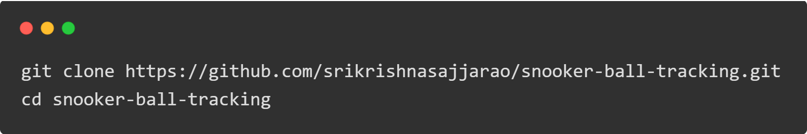
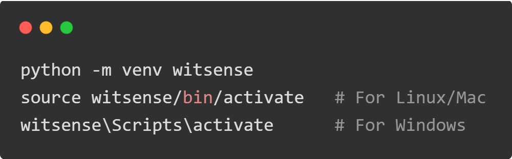

# snooker_ball_tracking

This project tracks a yellow snooker ball in a video using computer vision techniques. The program processes the input video, identifies the yellow ball, and draws a bounding circle, a bounding box, and a path representing the ball's movement. The processed video is saved as an output file.

## Features
1. Detects and tracks the movement of a yellow snooker ball.
2. Draws a bounding circle and path to represent the ball's trajectory.
3. Processes input videos and outputs the result with overlays.

## Folder Structure

## Prerequisites
1. Python 3.9 or higher installed on your system.
2. Virtual environment installed (optional but recommended).

## Installation

1. Clone this repository to your local machine
  
2. Set up a virtual environment (recommended)
  
3. Install dependencies using pip
  

